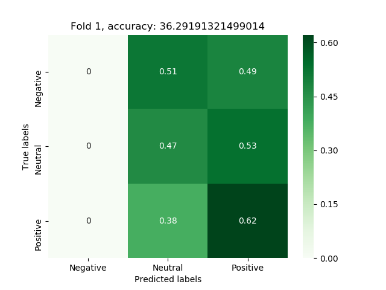

## Sentiment-analysis-nlp

### How to run:
* Install python 3.6.1 (tensorflow not supporting 3.7 currently)
* Install needed modules with: pip install -r src/requirements.txt
* Change dir from root to /src
* Run project with: python main.py

### Results:

#### Lexicons only, 2 classes:
* **Not using preprocessed lexicons:**

  Negation\Levenshtein's distance | 0 | 1 | 2 | 3 | 4 | 5 | 6
  :---: | :---: | :---: | :---: | :---: | :---: | :---: | :---:
  False |  59.2% |  58.5% |  56.6% |  56.7% |  56.2% |  56.2% |  55.6%
  True |  59.5% |  58.5% |  56.7% |  57.6% |  55.8% |  56.1% |  55.5%

* **Using preprocessed lexicons:**

  Negation\Levenshtein's distance | 0 | 1 | 2 | 3 | 4 | 5 | 6
  :---: | :---: | :---: | :---: | :---: | :---: | :---: | :---:
  False |  58.8% |  60.5% |  58.2% |  58% |  58.9% |  58.5% |  58.4%
  True |  60% |  60.7% |  59.1% |  59.1% |  59.3% |  59.3% |  59.4%

#### Lexicons only, 3 classes:
* **Not using preprocessed lexicons:**

  Negation\Levenshtein's distance | 0 | 1 | 2 | 3 | 4 | 5 | 6
  :---: | :---: | :---: | :---: | :---: | :---: | :---: | :---:
  False |  39.9% |  39% |  37.4% |  37.1% |  37.2% |  37.4% |  37.3%
  True |   40.3% |  39.3% |  38.3% |  38.2% |  38.4% |  37.8% |  37.8%

* **Using preprocessed lexicons:**

  Negation\Levenshtein's distance | 0 | 1 | 2 | 3 | 4 | 5 | 6
  :---: | :---: | :---: | :---: | :---: | :---: | :---: | :---:
  False |  38.7% |  39% |  38.4% |  39.3% |  38.4% |  38.2% |  38.1%
  True |  39.4% |  39.2% |  39.4% |  39.5% |  38.6% |  39% |  38.8%

#### Neural network with Lexicons, 2 classes:

* **Adeline with no bias**
    * Cross validation, with 5 splits
    * Stratification
    * Number of epochs: 100
    * Accuracy: 60.9%

      Split num | 0 | 1 | 2 | 3 | 4
      :---: | :---: | :---: | :---: | :---: | :---:
      | | 58.9% | 61.6% | 61.9% | 61% | 61%

* **Adeline with bias**
    * Cross validation, with 5 splits
    * Stratification
    * Number of epochs: 100
    * Accuracy: 60.7%

      Split num | 0 | 1 | 2 | 3 | 4
      :---: | :---: | :---: | :---: | :---: | :---:
      | | 59.2% | 61% | 61.9% | 61% | 60.4%

* **1 layer perceptron**
    * Cross validation, with 5 splits
    * Stratification
    * Number of epochs: 100
    * Accuracy: 56.01%
  
      Split num | 0 | 1 | 2 | 3 | 4
      :---: | :---: | :---: | :---: | :---: | :---:
      | |  55.3% |  53.6% |  53.8% |  58.9% |  58.3%
      
#### Neural network with Lexicons, 3 classes:
      
* **1 layer perceptron**
    * Cross validation, with 5 splits
    * Stratification
    * Number of epochs: 100
    * Accuracy: 39.5%
  
      Split num | 0 | 1 | 2 | 3 | 4
      :---: | :---: | :---: | :---: | :---: | :---:
      | |  36.3% |  38.5% |  41.5% |  40.1% |  41.3%
